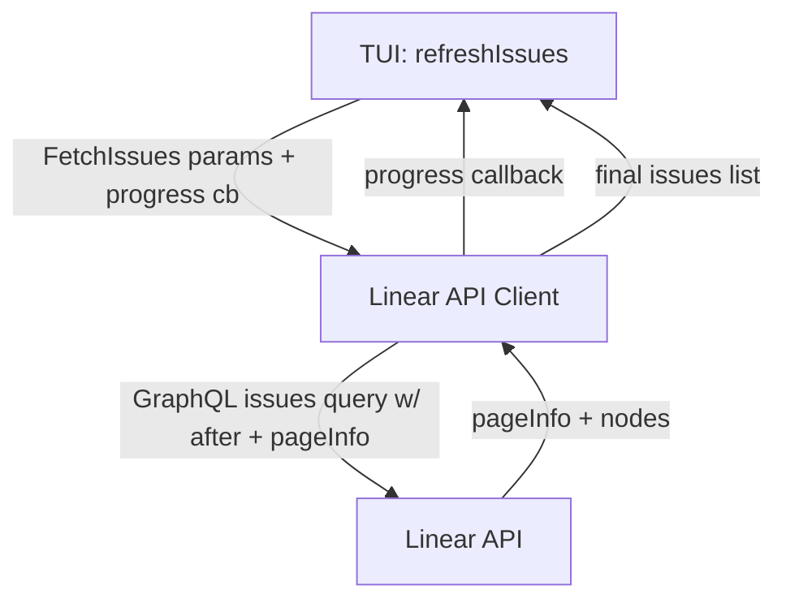

# Issue Fetching Completeness
## Overview
Implement full cursor pagination for issue fetching to avoid missing issues in large workspaces, and surface a lightweight progress indicator during multi-page fetches.

## Test Plan
- Add `TestFetchIssues_PaginatesAllPages` to assert `FetchIssues` loops over `pageInfo.hasNextPage` and concatenates results across pages.
- Add `TestFetchIssues_ProgressCallback` to assert the progress callback is invoked once per page with expected page and fetched counts.
- Add `TestFetchIssues_StopsWhenNoNextPage` to ensure pagination terminates when `hasNextPage=false` even if `endCursor` is present.
- Update `TestFetchIssues_RequestFormat` to include `pageInfo` in the mock response so the new query shape parses successfully.

## Code Plan
- Add a progress type and optional callback:
  - `type IssueFetchProgress struct { Page int; Fetched int }`
  - `FetchIssuesParams.OnProgress func(IssueFetchProgress)`
- Update `FetchIssues` to implement cursor pagination:
  - Include `after: $after` and `pageInfo { hasNextPage endCursor }` in the GraphQL query.
  - Loop until `pageInfo.hasNextPage` is false.
  - Append nodes into a single slice; apply client-side priority sorting after aggregation.
  - Invoke `OnProgress` after each page fetch with `Page` and `Fetched` totals.
- Update `App.refreshIssues` to pass a progress callback that updates the status bar text:
  - Example text: `"Loading issues (page %d, fetched %d)..."`.
  - Ensure UI updates use `QueueUpdateDraw`.
- Keep existing defaults (`LINEAR_PAGE_SIZE`) as per-page size.

## Architecture
- `internal/linearapi/client.go` owns pagination and aggregation of issue pages.
- `internal/tui/app.go` initiates issue fetching and surfaces progress via the status bar.
- Data flow: TUI triggers fetch → Linear API client paginates → progress callback updates UI → final aggregated issues update UI.

## Mermaid Diagrams

## Tasks
### Completed
- [x] Capture pagination gap and progress requirement.
- [x] Add pagination-aware tests in `internal/linearapi/client_test.go`.
- [x] Implement cursor pagination in `FetchIssues` and progress callbacks.
- [x] Update `App.refreshIssues` to show per-page progress.
### In Progress
- [ ] Run `go test ./...`.
### Future
- [ ] Evaluate pagination latency in large workspaces.

## Relevant Files
- `internal/linearapi/client.go`
- `internal/linearapi/client_test.go`
- `internal/tui/app.go`
